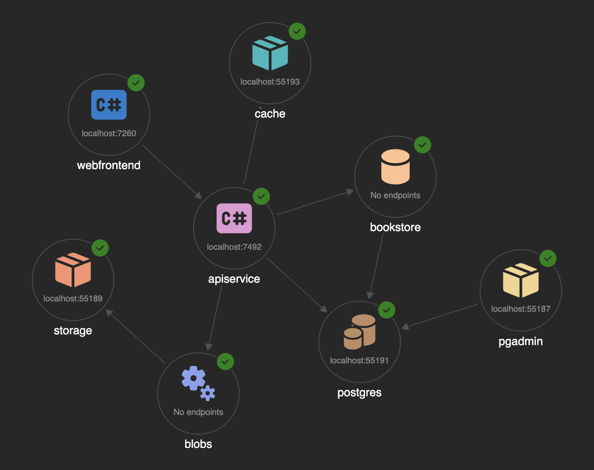

# Aspire
## Distributed Systems Without the Complexity

---

## Modern distributed application development

All these components must work together, locally and in production.

---

## Onboarding New Team Members

### The Hidden Cost

- 🚫 "Can you help me get it running?"
- 🚫 "What's the connection string for service X?"
- 🚫 "Why is service B failing?"
- 🚫 "Should I rebuild all images?"

**Each developer wastes 4-8 hours getting set up.**

Multiply by team size. This is expensive.

---

## The Root Issue

Services have **hard dependencies** on:
- Service discovery
- Port allocation
- Environment variables & secrets
- Knowledge of each resource (installation, best practices)

**There's no unified way to manage this.**

---

## Aspire

### One Unified Foundation

- Turn configuration headaches into repeatable code.
- Auto-discovery.
- Applies best practices for each resource.

---

## What Changes

- **Simple local setup** – One command, everything runs
- **Easy onboarding** – New devs get started in minutes
- **Realistic environment** – Dev mirrors production
- **Built-in observability** – See what's happening across all services
- **GitHub Copilot integration** – Get support configuring and debugging services
- **Test-friendly** – Run integration tests reliably

---

## Summary

**Without Aspire:** Manual orchestration, broken onboarding, unreliable tests

**With Aspire:** Unified, simple, observable

Let's see how it works.

---

## Aspire CLI

- Command-line tool for managing services and resources.
- Start, stop, and monitor services with simple commands.
- Automate common tasks and integrate with CI/CD pipelines.

--- 

## Aspire Dashboard

- Visualize service interactions and dependencies.
- Centralized view of all services, their status, logs, and metrics.
- Real-time updates and easy access to service details.

---

## Languages

- .NET
- Python and JavaScript (Node.js) since version 13 (November 2025)

---

## Demo Time

Bookstore sample application with 4 services:
- Frontend (Blazor)
- API (ASP.NET Core)
- Cache (Redis)
- Blob storage (Azure Storage Emulator)
- Database (PostgreSQL)

---

## Aspire Integrations (1/2)

- **Artificial intelligence** (GitHub Models, Ollama, OpenAI)
- **Cloud Providers** (AWS, Azure)
- **Caching & state** (Redis, Valkey, Garnet)
- **Compute & hosting** (Docker, Kubernetes)
- **Data & databases** (Elasticsearch, KurrentDB, Meilisearch, Milvus, MongoDB, MySQL, PostgreSQL, Qdrant, RavenDB, SQL Server, SQLite, SurrealDB)

---

## Aspire Integrations (2/2)

- **Frameworks & runtimes** (.NET MAUI, Bun, Dapr, Deno, Go, Java, JavaScript, Node.js, Orleans, PowerShell, Python, Rust)
- **Messaging & eventing** (Apache Kafka, LavinMQ, NATS, RabbitMQ)
- **Security & identity** (Keycloack)
- **Observability & logging** (Seq)
- **Reverse proxies & APIs** (YARP)
- **Dev tools & extensions** (Data API Buider, Dev Tunnels, flagd, goff, k6, MailPit, SQL Databse Projects)

---

## Demo Time

Create a new Aspire project, add services, and see how it simplifies development.
- Frontend (Typescript/Vite/React)
- Api (FastAPI/Python)
- Cache (Redis)

---

## Conclusion

- Aspire simplifies distributed application development by providing a unified foundation for managing services and resources.
- It reduces onboarding time, creates a realistic development environment, and offers built-in observability.
- With Aspire, teams can focus on building features instead of managing infrastructure.
- Try Aspire today and experience the difference in your development workflow!
