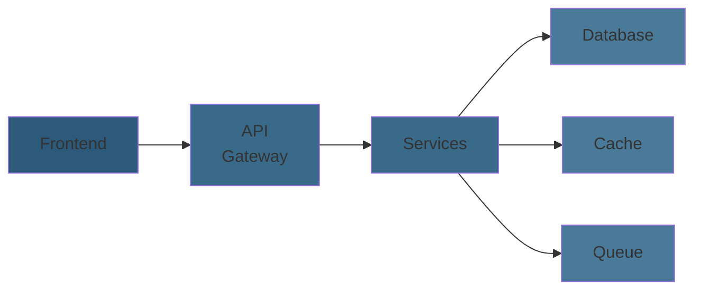

# Aspire
## Distributed Systems Without the Complexity

---

## The Architecture

All these components must work together, locally and in production.

---

## Onboarding New Team Members

### The Hidden Cost

- 🚫 "Can you help me get it running?"
- 🚫 "What's the connection string for service X?"
- 🚫 "Why is service B failing?"
- 🚫 "Should I rebuild all images?"

**Each developer wastes 4-8 hours getting set up.**

Multiply by team size. This is expensive.

---

## The Root Issue

Services have **hard dependencies** on:
- Network configuration
- Service discovery
- Secret management
- Port allocation
- Environment variables

**There's no unified way to manage this.**

---

## Aspire

### One Unified Foundation

- Turn configuration headaches into repeatable code. 
- Declare services once — Aspire generates consistent environments for local dev, integration tests, and production.

---

## What Changes

- **Simple local setup** – One command, everything runs
- **Easy onboarding** – New devs get started in minutes
- **Realistic environment** – Dev mirrors production
- **Test-friendly** – Run integration tests reliably
- **Built-in observability** – See what's happening across all services

---

## Summary

**Without Aspire:** Manual orchestration, broken onboarding, unreliable tests

**With Aspire:** Unified, simple, observable

Let's see how it works.

---

## Requirements

### Local development environment

- **.NET**
- **Docker** (or equivalent container runtime)
- **IDE**
    - **VS Code**
        - **C# extension** (optional, for code editing)
        - **Aspire extension** (optional, for integration)
    - **Visual Studio**
    - **JetBrains Rider**
- **Aspire CLI** (optional, for command line usage)

---

## Requirements

### Cloud-based development environment 

- GitHub Codespaces 
- Dev Containers 

---

## Aspire Samples 

https://github.com/dotnet/aspire-samples

---

## Aspire Community Toolkit 

https://github.com/CommunityToolkit/Aspire

--- 

## Aspire Integration Testing

- Aspire provides a testing framework to run integration tests against your services in a consistent environment.
- Tests can be run locally or in CI, ensuring reliability across environments.

---

### Aspire Observability

- Aspire includes built-in observability tools to monitor service health, logs, and performance metrics.
- This helps developers quickly identify and resolve issues across the entire system.

---

## Aspire Integrations (1/2)

- **Artificial intelligence** (GitHub Models, Ollama, OpenAI)
- **Cloud Providers** (AWS, Azure)
- **Caching & state** (Redis, Valkey, Garnet)
- **Compute & hosting** (Docker, Kubernetes)
- **Data & databases** (Elasticsearch, KurrentDB, Meilisearch, Milvus, MongoDB, MySQL, PostgreSQL, Qdrant, RavenDB, SQL Server, SQLite, SurrealDB)

---

## Aspire Integrations (2/2)

- **Frameworks & runtimes** (.NET MAUI, Bun, Dapr, Deno, Go, Java, JavaScript, Node.js, Orleans, PowerShell, Python, Rust)
- **Messaging & eventing** (Apache Kafka, LavinMQ, NATS, RabbitMQ)
- **Security & identity** (Keycloack)
- **Observability & logging** (Seq)
- **Reverse proxies & APIs** (YARP)
- **Dev tools & extensions** (Data API Buider, Dev Tunnels, flagd, goff, k6, MailPit, SQL Databse Projects)

---

